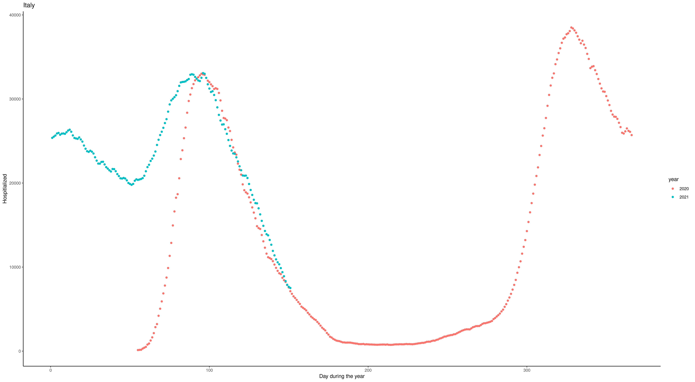

<script type="text/x-mathjax-config">
  MathJax.Hub.Config({
    TeX: { equationNumbers: { autoNumber: "AMS" } },
  });
</script>
<style>
.mjx-mrow a {
  color: black;
  pointer-events: none;
  cursor: default;
}
</style>


<h1><center>**Exam Econometrics (MSB104)**</center></h1>

<div class="solution">
<center>**SOLUTION PROPOSAL**</center>
</div>

<h2>**Subject code**: MSB104</h2> 

<h2>**Date**: 15.06.2021</h2> 

<h2>**Duration**: 5 hours + 30 minutes for upload to WISEflow. Total 5.5 hours.</h2> 

<h2>**Page count**: 12 including front page and appendix.  </h2> 

<h2>**Language**: English (you may submit your answer in English or any scandinavian tongue)</h2> 

<h2>**Course coordinator**: Henrik Lindegaard Andersen (hlan@hvl.no)</h2> 

## General information ##
- State any references clearly (as your assignment will be cross-checked in text analysis software). 
- Remember that the exam is *INDIVIDUAL*. It is NOT allowed to collaborate with others during the exam. Otherwise, all aids are allowed.
- You may write by hand and/or use any text editor; your answer must be uploaded to WISEflow as ONE final PDF-document.
- Do NOT write any personal identifiers on your hand-in (e.g. name or student id).
- You are NOT supposed to gather data OR to run any regression in this assignment.
- NB! Dot (.) is used as a decimal separator (e.g. Pi is 3.14159). Comma (,) is used as a thousand separator for readability (e.g. one thousand is 1,000).
- Your answer to each sub-question within Part I (210 minutes) will be given an equal weight in the evaluation. For Part II (90 minutes), the first subsection is weighted 50%, whereas subsection two and three each is weighted by 25%. The total weight of Part I is 210/300 and the weight of Part II is 90/300. 
- Do you have questions to the exam text? Part I/II: 92345700/41611857 (Henrik/Jørn). 
</h2>

\newpage

# Part I: Regression analysis with cross-sectional data and OLS (210 minutes)

Part I consists of 14 questions labeled a) to n). Each question is given equal weight.

Imagine yourself in some years, when one of your future kids are about to begin secondary education (“videregående skole”). You want to give him, or her, some good career advice, and because you have access to a random sample (n=2,786) of Norwegians aged 25–64 years, with a positive earned income, you run a linear regression of annual earned income (in NOK 1,000) on some explanatory variables and an intercept.

{width=75%}

The explanatory variables are: years of education after compulsory primary school (e.g. equal to 3 if a person only has ‘videregående skole’), a gender dummy, and age measured in years, as well as age squared. The results are summarized in Table 1.

Now, answer the following questions:

a)	Interpret the estimates: e.g. what are the consequences of a one unit change in years of education, man, and age? 

<div class="solution">
A one unit increase in the years of education is associated with a NOK 39,300 (1,000 x 39.30) increase in annual gross earned income. A man is expected to earn NOK 189.130 more than a woman. A person aged 26 earns NOK 17,644 more than a person aged 25. That is because we take the partial derivative of our equation with respect to age which is 33.4-0.303*2*x. Thus, 33.4-0.303*2*26 = 17.644, which multiplied by NOK 1,000 gives 17,644. The association is non-linear so that the earnings increase peaks at the age of 55 and becomes negative after that. Hence, a one-year increase from 63 is associated with an earnings decrease of about NOK 4,778.
</div>

b)	Briefly, comment on the statistical significance of the estimates.
<div class="solution">
We have a sufficiently large number of observations, so we can safely use the 1.96 critical value associated with a two-tailed test at the 5% level. The t-values indicates that all independent variables are statistically significant, meaning that we have evidence that the population parameters are different from zero.
</div>


c)	Explain what the R-squared and the F-statistic tells us. For the F-statistic, show how it is calculated. Note: You may want to know that the sum of squared residuals from the restricted model is 297,640,088.

<div class="solution">
In linear regression, the R^2 is defined as the explained variation divided by the total variation; that is interpreted as the fraction of the sample variation in y that is explained by x. Because we can never explain more than the total, the R2 will always be between 0 and 1. Because R2 never decreases when any variable is added to a regression (p. 81) makes it a poor tool for deciding whether one variable (or several) should be added to a model. R2 is a measure of goodness-of-fit for a model.
The null hypothesis behind the F-statistic is that none of our explanatory variables have any explanatory power for y; all the population parameters are equal to zero (p. 152). If that is true, then the conditional expectation of y is equal to the unconditional expectation. The F-statistic for testing this is [a] (R2/k) / ((1-R2)/(n-k-1), where n is the number of observations and k is the number of restrictions in the null; R2 is obtain from regressing y on x1, x2, …, xk. Thus, this test is valid only for testing joint exclusion of all independent variables. If we cannot reject the null, then there is no evidence that any of the independent variables help to explain y. The F-statistic can also be obtained using the residual standard error via the general formula [b]: ((SSRr-SSRur)/q) / (SSRur/(n-k-1)) where SSRur denotes the residual standard error from the unrestricted model (all the explanatory variables), and SSRr denotes the restricted model with just a constant; q is the number of exclusion restrictions in the null, and k is the degrees of freedom in the unrestricted model.
[a] (R2/k) / ((1-R2)/(n-k-1) = (0.2118/4) / ((1-0.2118)/(2786-4-1) = 186.82
[b] ((SSRr-SSRur)/q) / (SSRur/(n-k-1)) = ((297,640,088-234,603,166)/4) / (234,603,166 /(2786-4-1)) = 186.81
In this case, the F-statistic is so far out in the right tail that we should not need a p-value to realize that the null is rejected at any reasonable significance level. The variables have joint explanatory power.
</div>


d)	Explain why you would want to include age squared – and why is it OK to do so, when you are running a “linear” regression?
<div class="solution">
The association between age and earned income is non-linear (inversely U-shaped). As you grow older you obtain a higher earning. The earnings peak when a person is in his, or her, mid-fifties. When the individual gets older the earnings start to decrease. The specification of the model with age and ageSQ allows for this non-linear association. Since we are doing ‘linear regression’ it seems odd that this non-linearity is ok, but remember that ‘linear’ actually means linear in the parameters!
</div>

e)	Calculate [1] the expected annual earned income at the age of 35, if your kid is a boy, and obtains 4 years of education after primary school. If your kid is a girl, [2] how many years of education would she need, to obtain – roughly – the same expected earned income as the boy at the same age?
<div class="solution">
[1] 39.3*4 + 189.13*1 + 33.4*35 – 0.303*(35^2) – 509.89 = 634
[2] 39.3*9 + 189.13*0 + 33.4*35 – 0.303*(35^2) – 509.89 = 641
The boy could expect to earn about 634,000 with 4 years of education at the age of 35, while the girl would need to obtain 9 years of education to have the same expected earned income.
</div>

f)	Calculate a 90% confidence interval (CI) for the education estimate.
<div class="solution">
The formula for a confidence interval is betahat +/- c*se(betahat). In this case betahat is 39.30 and its standard error is 2.14. The critical value associated with a 90% CI is found using Table G2 as 1.645 when the DF approaches infinity. The lower bound is 35.78 and the upper bound is 42.82.
</div>

g)	You worry that there might be a bias in your estimate for the years of education. Imagine that people with higher ability also obtain more education, but ability is unobserved. Explain the direction of the bias in the education coefficient and state your assumptions.
<div class="solution">
Assuming that corr(education,ability) is positive and the true population parameter for the omitted ability is positive, there is a positive bias in the education-estimate in our wrongly specified model. In plain English: We are overestimating the effect of another year of education, because our econometric model does not include ability. See p. 90.
</div>

\newpage

h)	You have included age in your regression because you think is may be a good measure (a proxy-variable, that is) for labour market experience, which is not available in your data. It seems reasonable to assume that age and experience are highly correlated. Carefully explain what would happen to the coefficient and the standard error on age, if you were to include both age and experience - at the same time - in the regression.
<div class="solution">
This would be a case of multicollinearity. Multicollinearity occurs when you have a variable like age in your regression, and you add another variable like experience and the two are strongly correlated with each other. This will cause the variance/standard error of the estimate on the age-variable to increase, but fortunately nothing will happen in terms of bias. 
</div>


Now you run the same model, but you include some extra explanatory variables – all are binary indicator variables. The results are listed in Table 2.

{width=75%}

The added variables indicate whether an individual lives in Bærum/Asker or Stavanger/Sola municipalities, works part-time, is employed in the public sector, or has a top management job (e.g. CEOs or top officials) or a service occupation (e.g. bartenders, waiters, kitchen staff etc.).

i)	Write up the relevant equation and carefully explain why the residual standard error drops by approximately 29 million in Table 2 compared to Table 1.
<div class="solution">
The SSR is defined as the sum of the squared residuals. The residuals are obtained by taking the observed y-values and subtracting the predicted value for each observation in the sample – see formula 2.35, p. 65. The residuals capture the difference between the actual and the predicted values of the dependent variable. With a better model specification (i.e. capturing more of the variation), each residual will be smaller. Since we include more variables – and relevant variables – in Table 3 compared to the specification in Table 2, the individual residuals will be somewhat smaller in the latter specification. Therefore, the sum of squared residuals will also drop.
</div>

j)	Find the p-value for the Bærum/Asker-municipality estimate for a one-tailed test. Carefully explain what it means. You may either calculate the exact p-value using software or approximate it using the tables in the appendix of the book.
<div class="solution">
The observed t-value is 2.45. Using table G2, we see that the 1-tailed critical value associated with the 0.5% significance level is 2.576 whereas the value associated with the 1% level is 2.326, meaning that the p-value is between 0.01 and 0.005 in a 1-tailed test. The exact p-value can be obtained using R as “1-pt(2.45,2775)” which is equal to 0.0072. This means that we reject the null hypothesis that the population parameter for Bærum/Asker is less than or equal to 0 – we have evidence to support the claim that there indeed is a wage premium associated with living in these municipalities.
</div>

k)	You live in Haugesund, but after seeing these estimates, you consider moving to Stavanger in order to obtain a higher earned income. Statistically and econometrically speaking, this might not be a wise idea for two reasons. State these reasons.
<div class="solution">
Firstly (the less important reason): The Stavanger/Sola estimate is highly imprecisely estimated. The t-value is only 0.52, while the critical value is 1.96 at the 5% level in a two-tail test. Thus, we cannot reject the null hypothesis, that the population parameter is equal to zero. In real life there may very well be no earned income premium of living in the Stavanger/Sola-municipality. [In fact, this is wrong – it is just because the sample is too small – these municipalities are in the top 5 in the Norwegian earned income distribution.]
Second (the most important reason): This is an association not a causation – there is most likely omitted variable bias. People living in the Stavanger area are probably more likely to work on the continental shelf where wages a much higher due to various reasons (e.g. skills, risk, hours, demand/supply etc.).
</div>

l)	The point estimate for service-jobs is –44. Explain how this is to be interpreted, i.e. what is the group of reference?
<div class="solution">
Since there are two dummies capturing just two different occupational categories – of which there are many more – the association of –44 means the average earned income is 44,000 lower for people working in service occupations relative everyone else, excluding people who have management as their occupation. Indeed, people working with management and service make up only 31% of the sample.
</div>

You suspect that the variance of the unobserved determinants of earned income increases with the level of education. To test this, you calculate the squared residuals using the estimates in Table 2. You then regress these squared residuals on all the explanatory variables listed in Table 2. This auxiliary regression produces an F-statistic of 8.48 with 10 and 2,775 degrees of freedom.

m)	Briefly, explain what this test tells you (i.e. what’s the null hypothesis, the approximate p-value, and what is the conclusion). Also explain what the underlying problem is, and what may be done.

<div class="solution">
This is problem of heteroskedasticity, which happens when Var( u | x ) is not constant (known as homoskedasticity – assumption MLR.5). We only use MLR.1–MLR.4 to prove unbiasedness of OLS. We use MLR.5 to ensure unbiasedness of Var(betahat_j). Therefore, if the model suffers from heteroskedasticity, the variance of the OLS-estimators is biased, and cannot necessarily be used for inference. 
The test described in the text is the Breusch-Pagan test for heteroskedasticity. The null hypothesis is homoskedasticity and since the F-statistic of 8.48 with 10 and 2,775 degrees of freedom has an associated p-value of 0.000 (*) we can safely reject the null, and conclude there is strong evidence of heteroskedasticity. 
Heteroskedasticity will inflate the standard errors in Table 2. To remedy this, we run a model with heteroskedasticity-robust standard errors.
(*) The p-value can be found in R: “1-pf(8.4,10,2775)”, but it can also be approximated using Table G3c in the book: 10 numerator DF and approaching infinity in the denominator DF at the 1% level gives a critical value of 2.32. Since the F-statistic is much higher (8.48) we conclude that the p-value must be very close to zero.
</div>

\newpage
Instead of the models above, where you used earned income in NOK 1,000, you could have run models with other scaling’s or functional forms. Now imagine that you focus on the earned income in kroner; the first row in Table 3 shows the estimate on years of education in a simple linear regression using this dependent variable. The second and third row, respectively, shows the estimate from a log-level and log-log model. 

{width=60%}

Answer the following question:

n)	Explain the interpretation of the coefficient estimates in Table 3.
<div class="solution">
s.44
Log-level (semi-elasticity): A change of 1 year of schooling will increase the earned income by 4.9% Note that the following is wrong: another year of education increase log(earned income) by 4.9%.
Log-Log (elasticity): A 1 percent increase in schooling will increase the earned income by 0.174%. Thus a 10% increase in schooling will increase the earned income by 1,7%
</div>

\newpage

# Part II: Regression analysis with time series data and simultanous equations models (90 minutes)

Part II consists of three subsections. The first subsection is weighted 50%, whereas subsection two and three each is weighted by 25%. It is sufficient to provide short and punctuated answers to all of the questions.

## Short questions 

1. In time series econometrics, explain the conceptual differences for the data generating process (DGP) before and after its realization.   

<div class="solution">
Formally, a sequence of random variables indexed by time is called a stochastic
process or a time series process. (“Stochastic” is a synonym for random.) When we collect a time series data set, 
we obtain one possible outcome, or realization, of the stochastic process. 
</div>

2. Explain why a contemporanous exogenous process differs from a strictly exogenous process.

<div class="solution">
The TS.3' assumption that $E(u_{t}|x_{t})=0$ implies that $u_{t}$ and the explanatory variables ($X$) are contemporaneously
uncorrelated: $Corr(x_{t,j},u_{t})= 0$ for all $j$s. $E(u_{t}|X)=0$ requires more than contemporaneous exogeneity: $u_{s,j}$ must be uncorrelated with $x_{s,j}$, even when $j\neq$i In this case we say that the explanatory variables are strictly exogenous. 
</div>

3. Assume that you detect that TS.3 is violaed but not TS.3'. Given that the other time series assumptions are satisfied, how would this impact your results?

<div class="solution">
TS.3' is sufficient for proving consistency, while violation of TS.3 implies that the OLS estimator is unabiased. As such OLS properties are only valid in large samples. 
</div>

4. Assume that you want to estimate in a time series model the impact of a lockdown on the number of hospitalized Covid patients in Italy. Given the plot below, which variable do you think should be included in such a model in order to eliminate the problem of spurious regression? (red dot = 2020, blue dot = 2021, x="Day during the year", y="Hospitalized")

<div class="solution">
The year-to-year plot clearly indicates that the number of Covid-patients follows a seasonal pattern. Variables that captures this should be included in order to avoid the problem of spurious regression.
</div>


{width=75%}

5. Why do you think the year-to-year pattern of the plot from Great Britain differ such from  Italy, and how would you account for this in a time series regression model? (red dot = 2020, blue dot = 2021, x="Day during the year", y="Hospitalized")

{width=75%}


<div class="solution">
The seasonal pattern seems here to be broken. This is probably due to that UK is the leading country when it comes vaciation for a large fration of its population. A variable that captures the degree of vaciation should be included in order to capture this.
</div>


6. Why are demand and supply curves (with structural interpretation) difficult to estimate when using real life data?

<div class="solution">
The equilibrium condition combined with the equation for the supply and demand curve constiute a simultanous equation (SEM) model in whichthe variable price and quantiy commonly determined. This imply endogeneity problem in the form of simulteneity problem, which implies that the SEM model can not be given a structural interpretation.
</div>

7. Is there a approach to solve this problem?

<div class="solution">
The use of IV-variabel approach: Either the demand or the supply curve need an observed variable $z_{i}$ in which changes in the value of the variable would reveal the occurnse of the other curve.
</div>

## Stochastical regression models 

We have the following AR(1) process.

\begin{equation}
y_{t}=\mu+\rho y_{t-1}+u_{t} \text{ where } u_{t}\sim N(0,\sigma^2_{u})
\end{equation}
and moving average MA(1) process:
\begin{equation}
y_{t}=\gamma+e_{t}+\theta e_{t-1} \text{ where } e_{t} \sim N(0,\sigma^2_{e})
\end{equation}


1. Find, for the two model specifications above, its mean and and one-period ahead forecast value.

<div class="solution">
AR(1)
\begin{equation}
E(y_{t})=E(\mu + \rho (\rho y_{t-2}+ e_{t-1}) +e_{t}) = \mu + E(\sum_{j=0}^{\infty} \alpha^{j}(\mu+ e_{t-j}) ) = \sum_{j=0}^{\infty}\alpha^{j} \mu \\
\end{equation}
\begin{equation}
y_{t+1}=\mu + \rho y_{t}+u_{t+1} \Rightarrow E(y_{t+1}|y_{t}) = E(\mu + \rho y_{t}+e_{t+1}|y_{t})=\mu+\rho y_{t}
\end{equation}

MA(1)
\begin{equation}
E(y_{t})=E(\gamma + e_{t} + \theta e_{t-1})= \gamma    \\
\end{equation}
\begin{equation}
y_{t+1}=\gamma + e_{t+1}+\theta e_{t} \Rightarrow E(y_{t+1}|y_{t})=E(\gamma + e_{t+1}+\theta e_{t}) = \gamma + \theta e_{t}
\end{equation}
</div>

2. Why can't OLS be applied to the estimation to both of the model specifications?

<div class="solution">
Fitting the MA estimates is more complicated than it is in autoregressive models (AR models), because the lagged error terms are not observable. This means that iterative non-linear fitting procedures need to be used in place of linear least squares.
</div>

3. Do you think its advisable to use the model specification of the MA(1) process to model the stock market?

<div class="solution">
No, the stock market is commonly viewed to follow a Random-Walk process. If a MA(1) was the case, the estimated regression could be used as a "money-making machine" since profit would be ensured in the long run if buying under the trend and selling over the trend.  
</div>

## Application: The Phillips-Curve
Cf. appendix part II for output information.

(a) Explain the main difference between the two model specifications.

<div class="solution">
The first moel specifies the staic relationship between the impact unemployment has on the level of inflation. In the second model, the level of inflation has been replaced by the change in its inflation rate.
</div>

(b) In the diagnostic part of a time series regression model, does the output provide any clues of which specification that should be used?

<div class="solution">
Yes, $\pi$ variabel seems to be integrated of order one, while differencing it provides an I(0) variable.
</div>

(c) Interpret the results from the estimation of the coefficients and explain why the standard deviations differ in the two cases?

<div class="solution">
Solution: 
- Model 2 seems to best among the two: More significant variables, higher R-square.
- Differ: Standard differ since HAC seeks to correct for the presence of serial correlation, usually be giving higher standard deviation values.
</div>

\newpage

# Appendix 

## Part II


```{r}
knitr::knit_exit()
```

```{r}
title <- 'Exam_MSB104_Econometrics_S2021_Cont.Rmd'
title_exam <- 'Exam_MSB104_Econometrics_S2021_Cont'
rmarkdown::render(title, output_format=rmarkdown::html_document(css="css/OFF.css"), output_file=paste0(title_exam))
##
title <- 'Exam_MSB104_Econometrics_S2021_Cont.Rmd'
title_exam_sol <- 'Exam_MSB104_Econometrics_S2021_Cont_Sol'
rmarkdown::render(title, output_format=rmarkdown::html_document(css="css/ON.css"),output_file=paste0(title_exam_sol)) 
#servr::httw()
```

```{r}
#title <- 'Exam_MSB104_Econometrics_F2020.Rmd'
#title_exam <- 'Exam_MSB104_Econometrics_F2020'
#title_exam_sol <- 'Exam_MSB104_Econometrics_F2020_Solution_Proposal'
#wk1 <- paste0("wkhtmltopdf ", title,"html ",title_exam,"pdf")
#wks <- paste0("wkhtmltopdf ", title,"html ",title_exam_sol,"pdf")
#system(wk1)
#system(wk2)
```

