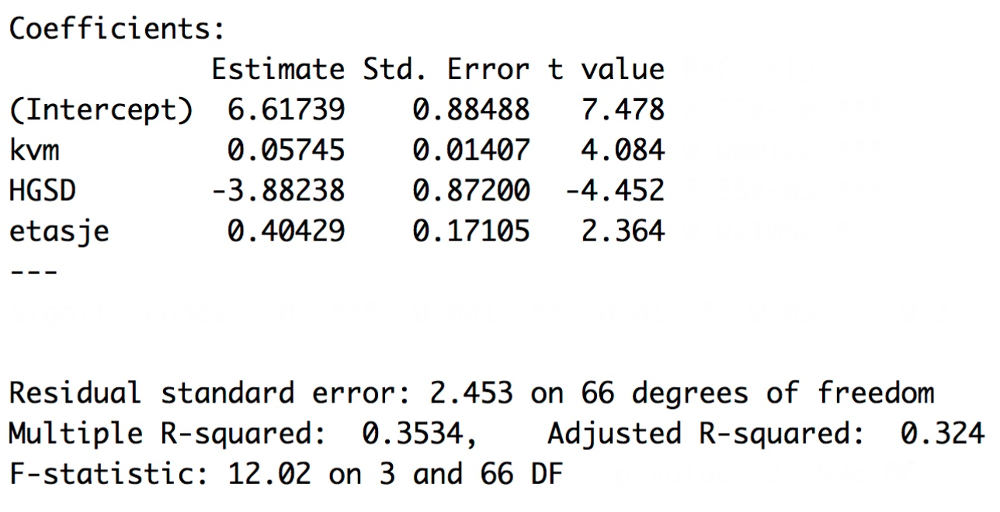

<script type="text/x-mathjax-config">
  MathJax.Hub.Config({
    TeX: { equationNumbers: { autoNumber: "AMS" } },
  });
</script>
<style>
.mjx-mrow a {
  color: black;
  pointer-events: none;
  cursor: default;
}
</style>


<h1><center>**Exam Econometrics (MSB104)**</center></h1>

<div class="solution">
<center>**SOLUTION PROPOSAL**</center>
</div>

<h2>**Subject code**: MSB104</h2> 

<h2>**Date of exam**: 30.11.2020</h2> 

<h2>**Language**: English (you may submit your answer in English or any scandinavian tongue)</h2> 

<h2>**Course coordinator**: Henrik Lindegaard Andersen (hlan@hvl.no)</h2> 

## General information ##
- State any references clearly (as your assignment will be cross-checked in text analysis software). 
- Remember that the exam is *INDIVIDUAL*. It is NOT allowed to collaborate with others during the exam. Otherwise, all aids are allowed.
- You may write by hand and/or use any text editor; your answer must be uploaded to WISEflow as ONE final PDF-document.
- Do NOT write any personal identifiers on your hand-in (e.g. name or student id).
- You are NOT supposed to gather data OR to run any regression in this assignment.
- Your answer to each sub-question within Part I (210 minutes) will be given an equal weight in the evaluation, and equally for Part II (90 minutes).
- Do you have questions to the exam text? Part I/II: 92345700/41611857 (Henrik/Jørn). 
</h2>

\newpage


# Part I: Regression analysis with cross-sectional data (210 minutes)
You have been hired by "Tromb AS" --a local landlord-- who rents out apartments in Haugesund, Stavanger and Bergen. The rental market is highly competitive and therefore Tromb is eager to price his apartments just right. Your task is to carry out a statistical analysis of the *rental* market for Tromb. 

The Tromb-business is family run, and no-one have any formal education in economics or econometrics, so you must be careful to explain your results.


## A: Build you own model

i. Carefully specify a good *econometric model* of the actual monthly price of an apartment in Haugesund today. The model must be linear in parameters and it must include exactly five $x$-variables. Assume that any cross-sectional data, that you want, is available to you, but for Haugesund only.
Remember to explain the unit of measurement for each of your variables (e.g. `size' measures the size of the apartment in square metres).

<div class="solution">
Solution: One example may be
\begin{equation*}
\begin{split}
\texttt{price}_i = \beta_0 + \beta_1 \cdot \texttt{antall rom}_i 
                            + \beta_2 \cdot \texttt{bygget år}_i       
                            + \beta_3 \cdot \texttt{nylig oppusset}_i \\
                            + \beta_4 \cdot \texttt{etasje}_i
                            + \beta_5 \cdot \texttt{rejsetid til sentrum}_i 
                            + u_i
\end{split}
\end{equation*}

- $\texttt{antall rom}$ is equal to one if the apartment has only one room (i.e., a studio apartment), two if there is one bedroom and so on.\
- $\texttt{bygget år}$ is the calendar year that the house where the apartment sits was build. 
- $\texttt{nylig oppusset}$ is a dummy variable equal to one if the apartment is newly renovated, and zero otherwise.
- $\texttt{etasje}$ is equal to zero if the apartment is located in the basement, one if it is on the ground floor, and so on. 
- $\texttt{rejsetid til sentrum}$ is the traveling time to the city centre (town hall) as measured by the fastest means of transportation (walk, bicycle or public bus).
</div>

ii. Briefly discuss each element of your equation and explain what sign ($\pm$) you expect on each $\hat{\beta}_j$, if you could run the regression. Also explain if you expect the actual partial effect of $\beta_j$ to be linear, although you perhaps did not include any higher order polynomial functions for the particular $x_j$ to capture non-linearity.

<div class="solution">
Solution:  I expect the coefficient on $\texttt{antall rom}$ to be positive, because more rooms makes the apartment more desirable (e.g. to students who want to split the rent), but also because apartments with more rooms are generally larger and therefor more costly. Maybe one ought to allow for diminishing effect when $\texttt{antall rom}$ increases by including $\texttt{rom}^2$. 

The estimated coefficient on $\texttt{bygget år}$ ought to be negative because newer apartments are more desirable, so when this x-variable increase by one unit, the price is expected to increase. 

But since old apartments may be modernized, I want to allow for a shift in the association between $\texttt{bygget år}$ and $\texttt{price}$ if the apartment is renovated. I expect that a renovation has a positive association with the price and therefore should the coefficient on $\texttt{nylig oppusset}$ be positive.

$\texttt{etasje}$: I expect the coefficient to be positive. In reality the price increase may not be linear, but this is not captured in this model. This is so because an basement located in the basement may be disproportionally unattractive and, likewise, it does not make a huge difference if the apartment is located on the 6th or 7th floor, for example. 

$\texttt{rejsetid til sentrum}$: I expect the coefficient to be negative, because a further distance makes the apartment less attractive. Here the true effect may also be diminishing. 

My dependent variable $\texttt{price}$ is the monthly price of an apartment---the actual price that the renter pays, and $u$ is an unobserved error term that captures everything that I have not controlled for in my econometric model. Finally, $\beta_0$ is an intercept which captures the hypothetical price of an apartment where all my $x$-variables equals zero.
</div>

iii.
Now, first explain generally what multicollinearity is, and what its consequences are for the variance and bias (4-5 typed lines will be sufficient). Next, in the context of the model you have written, do you think that you have problems with multicollinearity (you only have to give one example)?

<div class="solution">
Solution: Multicollinearity occurs when you have a variable $x_1$ in your regression, and you add another variable $x_2$ that is strongly correlated with $x_1$. Depending on the degree of correlation the variance of the $\hat{\beta}_1$ may increase dramatically, but there are not consequences insofar $E(\hat{\beta}_1) = \beta_1$. 

I do not think that I have any major problems with multicollinearity in my econometric model. If I should mention one case, then it would be $\texttt{bygget år}$ and $\texttt{rejsetid til sentrum}$ because it may be so, that newer apartments are located further away from the city centre (a positive correlation). Perhaps related, you could have a correlation between $\texttt{rejsetid til sentrum}$ and $\texttt{etasje}$.
</div>

iv.
First, explain generally what heteroskedasticity is, and what the consequences are for variance and bias in the OLS estimators of $\beta_j$ (6-7 typed lines). Second, in the context of your model, do you think that you have problems with heteroskedasticity (one example will suffice) and, if you do, how would you fix it?

<div class="solution">
Heteroskedasticity occurs when the conditional variance of the error term is not constant
$$ \texttt{Var} (u \mid x_1, x_2, \ldots, x_k) \neq \sigma^2 $$

Heteroskedasticity does not cause bias in the OLS estimators, because we only used MLR.1--MLR4 to prove unbiasedness. MLR.5 (homoskedasticity) was used to ensure unbiasedness of $\texttt{Var} (\hat{\beta}_j)$. Therefore, in the presence of heteroskedasticity, the variance of the OLS estimator is biased, and it is no longer valid for constructing CIs or t-statistics. 

Yes, I may have problems with heteroskedasticity in my model, as the variation in $\texttt{price}$ may increase as, say, the apartment increases in size, which I measure by the number of bedrooms. I could remedy this by using a heteroskedasticity robust variance estimator.

</div>


## B: Interpretation and inference in a basic model
Table 1 in the Appendix shows the regression output from **R** using a random cross-section that "Tromp AS" has provided. The sample was collected from finn.no and contains 70 rental apartments located in Haugesund, Stavanger and Bergen. The multiple regression model was the following:

\begin{equation}
 \texttt{price}_i = \beta_0 + \beta_1 \cdot \texttt{kvm}_i 
                            + \beta_2 \cdot \texttt{HGSD}_i       
                            + \beta_3 \cdot \texttt{etasje}_i     
                            + u_i     
\end{equation}

The $x$-variables have the following units: $\texttt{kvm}$ is size measured in square metres, $\texttt{HGSD}$ is a dummy variable equal to 1 if the city is Haugesund and zero otherwise, and $\texttt{etasje}$ is the location of the apartment (0 is basement, 1 is ground floor, and so on). $\beta_0$ is a constant and $u_i$ is an error term. $\texttt{price}$ is measured in 1000 kr. and it is the asking price.

Now, complete the following assignments:

a. Give a careful interpretation of the estimates and their units in Table 1.

<div class="solution">
Solution: The asking price of an apartment (in 1000 kr.) increase by 0,057 if an apartment increase by one square metre. Since the unit of the $y$-variable is in 1000 kr. this means 57 kr. for each extra square meter or 570 kr. for 10 square metres (which, I believe, is about the size of a room).

If the apartment is located in Haugesund, then the price decrease by 3882 kr. (3,882 times 1000). 

If the apartment is located on the first floor, as opposed to the ground floor, the price increase by 404 kr. (0,404 times 1000). 

The constant is equal to 6,6 which means that a hypothetical apartment located in the basement, that has a size of 0 square metres, and is not in Haugesund costs 6600 kr.
</div>

b. Is the price really lower in Haugesund? State your hypotheses and give at careful interpretation, as well as a non-technical conclusion that Tromb will understand. 

<div class="solution">
Solution: My null hypothesis is $H_0$: $\beta_\texttt{Haugesund} = 0$ versus $H_1$: $\beta_\texttt{Haugesund} < 0$

The $t$-statistic for $\hat{\beta}_\texttt{Haugesund}$ is -4,45, and the one-tailed 5% critical value with 66 degrees of freedom (70-3-1) is approximately -1,67 (I use the t-distribution table to find this value with df=60, which is the closest I come to 66). Therefore, I reject the null hypothesis. 

This means that I am very certain that the price is lower in Haugesund---the uncertainty is only 5% in my test. 
</div>

c. What is the approximate p-value of your test above and what does it it mean (use Table G.2 in the book to give your answer)?

<div class="solution">
Solution: I can approximate the p-value using Table G.2. The critical value with 66 degrees of freedom associated with a 0,5\% significance level (the lowest in the table) is -2,66. That means that the p-values is less than 0,5\%. Compared to the outcome we observe (-3,88), the p-value is the probability of observing an outcome as extreme (or more), given $H_0$ is true, which is highly unlikely.
</div>

d. Calculate a 95% confidence interval for $\beta_2$. Carefully interpret your findings, so that a layman will understand them.

<div class="solution">
Solution: There are 66 degrees of freedom, and the formula for the confidence interval is
$$ \hat{\beta}_2 \pm c \cdot \texttt{se}(\hat{\beta}_2) $$
The only thing I need to find in Table G.2. is $c$, which is the critical value associated with a 95% confidence interval. I use df=60 and a 2-tailed probability of 0,05, which gives me a critical value of 2,000. Therefore I get $-3,88 \pm 2,00 \cdot 0,872 = (-5,524;-2,136)$.

This means that in 95% of the cases (if I were to repeat the whole exercise), I would get an estimate of $\hat{\beta}_2$ contained in this interval. I could also state that I am 95% certain that the price of an apartment in Haugesund is between 2136 kr. and 5524 kr. lower than in other cities in the population.
</div>

e. Now, assume the existence of an unobserved variable $\texttt{km}$, which measures the distance to the city centre for an apartment, and assume that the correlation between $\texttt{km}$ and $\texttt{HGSD}$ is strictly negative, i.e. $\texttt{Corr}(\texttt{km},\texttt{HGSD}) <0$. First, explain what you think will happen to $\hat{\beta}_2$ if you were to include this new variable $\texttt{km}$ in the regression. Second, explain why it is unreasonable to assume that $\beta_2$ has a *causal* interpretation in equation (1).


<div class="solution">
Solution: The slope parameter on $\texttt{km}$ would be negative, because an apartment located further away from the city centre would be less attractive. Hence, I expect the bias in $\beta_2$ to be positive, and therefore I would expect an even lower price for an apartment in Haugesund if I were to include the omitted variable $\texttt{km}$. 

The critical assumption is MLR.4. In equation (1) the error term contains the unobserved $\texttt{km}$, which is both correlated with $\texttt{price}$ and $\texttt{HGSD}$. Therefore MLR.4 is violated and we have a case of omitted variable bias that inflates $\beta_2$.

</div>

f. Finally, discuss the goodness-of-fit as given in Table 1 for the purpose of prediction, i.e. $\texttt{E}\,(\texttt{price} \mid \mathbf{x})$, as well as inference for any particular $\beta_j$, i.e. $\partial \, \texttt{price} / \partial \beta_j$.

<div class="solution">
Solution: The goodness-of-fit is measured by $R^2$ which is equal to 0,35. This means that 35\% of the variation in prices are explained by the model. If I were to predict the price of an apartment, I think this number is too low---I would need to include more relevant $x$-variables, that help me make a more accurat prediction of the price. If the purpose is to make inference about $\beta_j$ then the $R^2$ is not important. $\ldots$ 
</div>

## C: Interpretation and inference in a log-level model
Now you run a new econometric model based on the same data as in Question B. The model is given below in equation (2), and the results are given in Table 2 in the Appendix.

\begin{equation}
 \log \left( \texttt{price}_i \right) = \beta_0 + \beta_1 \cdot \texttt{kvm}_i 
                            + \beta_2 \cdot \texttt{HGSD}_i       
                            + \beta_3 \cdot \texttt{etasje}_i 
                            + \beta_4 \cdot \texttt{rom}_i
                            + u_i     
\end{equation}

All the $x$-variables are the same as stated above except that $\texttt{rom}$ is added. This variables measures the number of bedrooms in the apartment.


i. Interpret the estimates for $\beta_1$ and $\beta_4$. Compare $R^2$ of this model with the $R^2$ of 0,35 from the model in equation (1).

<div class="solution">
Solution: The coefficient on the $\texttt{kvm}$ variable tells us that the price increase by 3,3% if the apartment increase 10 square metres in size, ceteris paribus. The coefficient $\texttt{rom}$ tells us that the price increase by 9% if the apartment increases 1 room in size, holding everything else fixed. The $R^2$ of this equation is not comparable to the $R^2$ of the former model, because the dependent variable has changes from level to the natural log.
</div>


ii. Test the following joint null hypothesis  $H_0$: $\beta_1 = 0$ and $\beta_4 = 0$. You may find it usefull to know that the mean of the squared residuals (i.e. $\frac{1}{70} \cdot \sum \hat{u}_i^2$) from the regression in equation (2) is 0,0509, while the mean of the squared residuals from a regression of $\log \left( \texttt{price} \right)$ on $\texttt{HGSD}$ and $\texttt{etasje}$ (plus a constant) is 0,0684. Do you reject the null hypothesis at the 1% level?

<div class="solution">
Solution: The F-statistic is given by
\[ \frac{\left( \texttt{SSR}_r - \texttt{SSR}_{ur} \right) / q}{\texttt{SSR}_{ur} / (n-k-1)} \]

In this case the $ur$ denotes the model that includes the variables in the null hypothesis and $\texttt{SSR}_{ur}$ is calculated as $n$ times the mean of the squared residuals: $0.0509 \cdot 70 = 3.56$. Likewise $\texttt{SSR}_{r} = 0.0684 \cdot 70 = 4.79$. $q=2$ is the number of exclusion restrictions, which is given by our null hypothesis. So we get: 
\[ \frac{\left( 4.79 - 3.56 \right) / 2}{3.56 / (70-4-1)} = 11,1 \]

As there are two degrees of freedom in the numerator and 65 degrees of freedom in the denominator, we get a critical value of about 4.98 using Table G.3c (the 1\% level) for the F distribution. The test-statistic clearly falls in the reject region, which is why we reject the null hypothesis and conclude that at least one of the parameters listen in our null hypothesis is different from zero.
</div>

iii. Now, compare the econometric model in equation (2) with an otherwise identical model, execpt you do not include $\texttt{rom}$. Explain what happens to the sampling variance of the OLS slope estimator $\hat{\beta}_1$ when you add $\texttt{rom}$ to the model. Note that the correlation between $\texttt{rom}$ and $\texttt{kvm}$ is 0,72. You may relate the answer to the components of the variance formula
    $$ \texttt{Var} \left( \hat{\beta}_j \right) = \frac{\sigma^2}{\texttt{SST}_j \cdot \left( 1- R_j^2 \right)} $$

<div class="solution">
Solution:  This is clearly a case of multicollinearity between $\texttt{rom}$ and $\texttt{kvm}$. The $R^2_j$ comes from a regression of $\texttt{kvm}$ on $\texttt{rom}$ and the other x-variables. As you add this highly correlated variable $\texttt{rom}$ to the auxiliary regression, the $R^2_j$ increase (probably dramatically) which is why term in the denominator of the variance $(1-R^2_j)$ decrease (i.e. gets closer to zero), and hence the variance of $\hat{\beta}_\texttt{kvm}$ increase. 
</div>

iv. Assume that the correlation between $\texttt{rom}$ and $\texttt{HGSD}$ is zero. What is the implication for $\texttt{Var} \left( \hat{\beta}_{2} \right)$ if we add $\texttt{rom}$ to the econometric model?

<div class="solution">
Solution: Nothing should happen to the variance then, as the covariance is zero $\ldots$
</div>

# Part II: Regression analysis with time series data and simultanous equations models (90 minutes)

Part II consists of three subsections. Each subsection is given equal weight. It is sufficient to provide short and punctuated answers to all of the questions.

## Short questions 
1. In a realized set of time series observations, would an arbitrary reordering of the observations have any impact on the estimated results?

<div class="solution">
Solution: Yes, the nature of time series is based upon the notion of temporal ordering of
observations.
</div>

2. Facing a situation in which you for a time series regression model
need to capture the economic impact of a lockdown due to Corona-virus. What type of time series variable would you use to capture such an effect?

<div class="solution">
Solution: Dummy variable can be used to capture the state of a lockdown. But since an index number can aggregate vast amount of information in a single quantity (e.g., school-closing, shop-closing, work-at-home etc.), this type of variable is if accessiblethe preferred one.
</div>

3. For many time series model applications, it is reasonable to assume that TS'.3 assumption $E(u_{t}|X_{t})=0$ holds, but not $E(u_{t}|X)=0$. Explain the main difference between these two assumptions.

<div class="solution">
Solution: In the first the error term only conditioned on that $u_{t}$ is uncorrelated with the explanatory variables in our specified model. For the later, it must be uncorrelated with explanatory variables in all previous and future periods
</div>

4. It is more common for OLS-estimators in a regression model to be consistent than unbiased, since we can replace the assumption of TS.3 with the TS'.3. However, there are some additional requirements needed for this to be the case. Can you name them? 

<div class="solution">
Solution: (1) Need a large sample. The time series in the regression mode need to be (1) stationary and (2) weakly dependent.
</div>

5. Let's say you have estimated a macroeconomic model for the purpose of forecasting (i.e., provided point estimates with error bands) the future path of the development of short term interest rates. What impact would the detection of serial correlation have on these results?

<div class="solution">
Solution: (1) Point estimate correct, (2) Error bands wrong (most likely too narrow)
</div>

6. Why do economic researchers often find it more convenient not to adjust for serial correlation in the error term in a regression model, but rather present the results based on robust HAC standard errors? 

<div class="solution">
Solution: Correcting for serial correlation could in practice be difficult since it is based on the assumption of (1) strictly exogenous regressors and (2) that the error term it follows an AR(1) process.
</div>

7. What is meant by simultaneity and how does it violate the OLS classical assumption?
Give an example how simultaneity can occur in the context of a time series regression model.

<div class="solution">
Solution: 
Simultaneity occurs if the dependent variable jointly determine with at least one of the exogenous variable in the regression model. Violates TS.3/TS'.3.
- Example: (1) Police force and murder rate in a city. (2) Exchange rate and interest rate setting by the central bank.
</div>

## Stochastical regression models 

We have the following finite distributed lagged model:

\begin{equation}
y_{t}=\alpha+\theta_{0}z_{t}+\theta_{1}z_{t-1}+u_{t}
\end{equation}

1. Show that 
a. Temporary change by 1 in period t would imply changes equal to:
- period t : $\theta_{0}$ \
- period t+1 : $\theta_{1}$ \
- period t+2: $0$ \

<div class="solution">
Temporary change: (c+1) in period t, otherwise c
$$
y_{t-1}=\alpha+\theta_{0}c+\theta_{1}c+u_{t} \\
y_{t}=\alpha+\theta_{0}(c+1)+\theta_{1}c+u_{t} \\
y_{t+1}=\alpha+\theta_{0}c+\theta_{1}(c+1)+u_{t} \\
y_{t+2}=\alpha+\theta_{0}c+\theta_{1}c+u_{t} \\
$$
Which implies:
$$
y_{t}-y_{t-1} = \theta_{0}\\
y_{t+1}-y_{t-1} = \theta_{1} \\
y_{t+2}-y_{t-1} = 0\\
$$
</div>

b. Permanent change by 1 in period t would imply change equal to
- period t : $\theta_{0}$ \
- period t+1 : $\theta_{0}+\theta_{1}$ \
- period t+2: $\theta_{0}+\theta_{1}$ \

<div class="solution">
Permanent change: change + 1 in period t and onwards, otherwise c:
$$
y_{t-1}=\alpha+\theta_{0}c+\theta_{1}c+u_{t} \\
y_{t}=\alpha+\theta_{0}(c+1)+\theta_{1}c+u_{t} \\
y_{t+1}=\alpha+\theta_{0}(c+1)+\theta_{1}(c+1)+u_{t} \\
y_{t+2}=\alpha+\theta_{0}(c+1)+\theta_{1}(c+1)+(c+1)+u_{t} \\
$$
Which implies:
$$
y_{t}-y_{t-1} = \theta_{0}\\
y_{t+1}-y_{t-1} = \theta_{0} + \theta_{1} \\
y_{t+2}-y_{t-1} = \theta_{0} + \theta_{1} \text{long-run multiplier} \\
$$
</div>

2. A random walk model without and with drift is given as\
\begin{equation}
y_{t}= y_{t-1}+e_{t}
\end{equation}
\begin{equation}
y_{t}=\beta_{0} + y_{t-1}+e_{t}
\end{equation}
Where $e_{t}\sim i.i.d. N(0,\sigma^2_{e})~$

For (4), (5) find its (i) expected value, (ii) variance and (iii) forecast h-periods ahead 

<div class="solution">
Random walk (without drift):
$$
y_{t}=y_{t-1}+e_{t}\\
(i)\\
E(y_{t})=E(y_{t-2}+e_{t-1}+e_{t})=E(y_{0}+e_{1}+e_{2}...+e_{t})=E(y_{0})=y_{0}\\
(ii)\\
Var(y_{t})=Var(y_{0}+e_{1}+e_{2}...+e_{t})=t\sigma_{e}^{2}\\
(iii)\\
E(y_{t+h}|y_{t})=E(y_{t+h}+e_{t+h}|y_{t})=E(y_{t}+e_{t+h}+e_{t+h-1}+...+e_{t}|y_{t})=y_{t}\\
$$
Random walk with drift:
$$
y_{t}=\beta_{0}+y_{t-1}+e_{t}\\
(i)\\
E(y_{t})=E(\beta_{0} + \beta_{0} + y_{t-2}+e_{t-1}+e_{t})=E(t\beta_{0} + y_{0}+e_{1}+e_{2}...+e_{t})=E(t\beta_{0} +y_{0})=t\beta_{0} + y_{0}\\
(ii)\\
Var(y_{t})=Var(ty_{0}+e_{1}+e_{2}...+e_{t})=t\sigma_{e}^{2}\\
(iii)\\
E(y_{t+h}|y_{t})=E(\beta_{0} + y_{t+h}+e_{t+h}|y_{t})=E(h\beta_{0} + y_{t}+e_{t+h}+e_{t+h-1}+...+e_{t}|y_{t})=h\beta_{0} + y_{t}\\
$$
</div>

3. Given the task of modeling the stock market return for (i) 20 days ahead and (ii) 20 years ahead.  Which version of the random walk models above would you employ for case (i) and case (ii)?

<div class="solution">
20 days ahead $\Rightarrow$ Random walk without drift, due to zero growth rate prediction in the short run. 
20 years ahead $\Rightarrow$ Random walk with drift, due to expectation of long run positive growth in the economy.
</div>

## Application: Effects of personal exemption on fertility rates
Cf. appendix part II for output information.

(a) Explain the main difference between the two model specifications\

<div class="solution">
Solution: Model 2 provides the variables in model 1 on differentiated form, representing changes in variables instead of levels.
</div>

(b) In the diagnostic part of a time series regression model, which of the issues that are commonly looked for in a time series model are analyzed in the output and which one are left out?

<div class="solution">
Solution:
1. Omitted variables: (1) trend: left out (formal).  
1. Whether the time series variable are persistent: included.
1. Serial correlation: included.
1. Heteroskedasticity: left out.
1. Simultaneity: left out.
</div>

(c) In the diagnostic part from the output results, differentiating the variables (model specification 2) provides variables that are much less persistent.  Still, there is clearly a spike for the variables during the second world war. What are the consequences of such a spike and how should it be taken care off?

<div class="solution">
Solution: The spike introduces heteroskedasticity (variance of $y_{t}$ dependendt on time). Problem can probably be solved by introducing a dummy variable that captures the effect of the second world war.
</div>

(d) Interpret the results from the estimation of the coefficients and explain why the standard deviations differ in the two cases?

<div class="solution">
Solution: 
- Significant: Only lag 2. Interpretation: Takes some time for changes in exemption to be transmitted to changes in fertility
- Differ: Standard differ since HAC seeks to correct for the presence of serial correlation, usually be giving higher standard deviation values.
</div>

\newpage

# Appendix 

## Part I

### Table 1


### Table 2


\newpage

## Part II

```{r, child=c('application/Application_Fertility_lagged.Rmd')}
```


```{r include=FALSE}
knitr::knit_exit()
```


```{r}
title <- 'Exam_MSB104_Econometrics_F2020.Rmd'
title_exam <- 'Exam_MSB104_Econometrics_F2020'
rmarkdown::render(title, output_format=rmarkdown::html_document(css="css/OFF.css"), output_file=paste0(title_exam))
##
title <- 'Exam_MSB104_Econometrics_F2020.Rmd'
title_exam_sol <- 'Exam_MSB104_Econometrics_F2020_Solution_Proposal'
rmarkdown::render(title, output_format=rmarkdown::html_document(css="css/ON.css"),output_file=paste0(title_exam_sol)) 
```

```{r}
#title <- 'Exam_MSB104_Econometrics_F2020.Rmd'
#title_exam <- 'Exam_MSB104_Econometrics_F2020'
#title_exam_sol <- 'Exam_MSB104_Econometrics_F2020_Solution_Proposal'
#wk1 <- paste0("wkhtmltopdf ", title,"html ",title_exam,"pdf")
#wks <- paste0("wkhtmltopdf ", title,"html ",title_exam_sol,"pdf")
#system(wk1)
#system(wk2)
```

