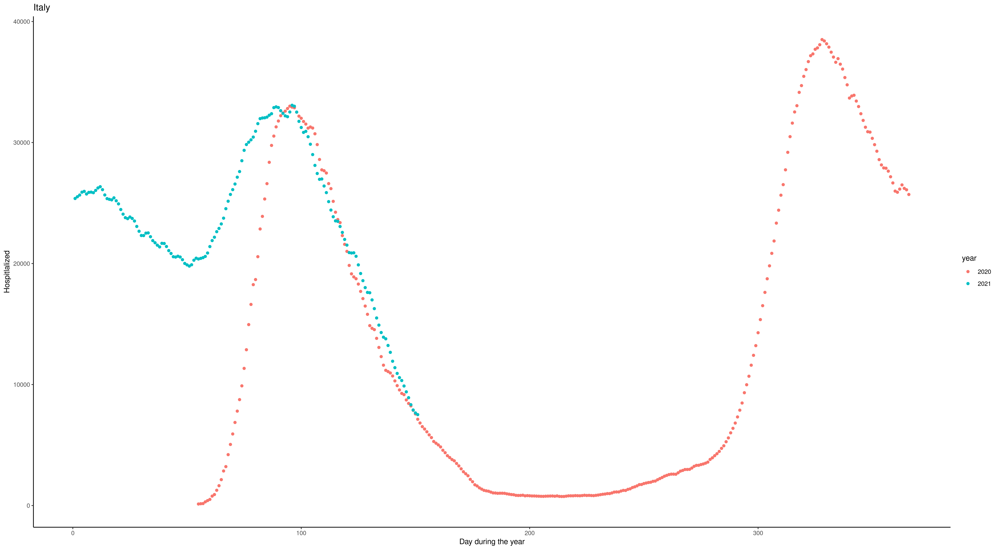
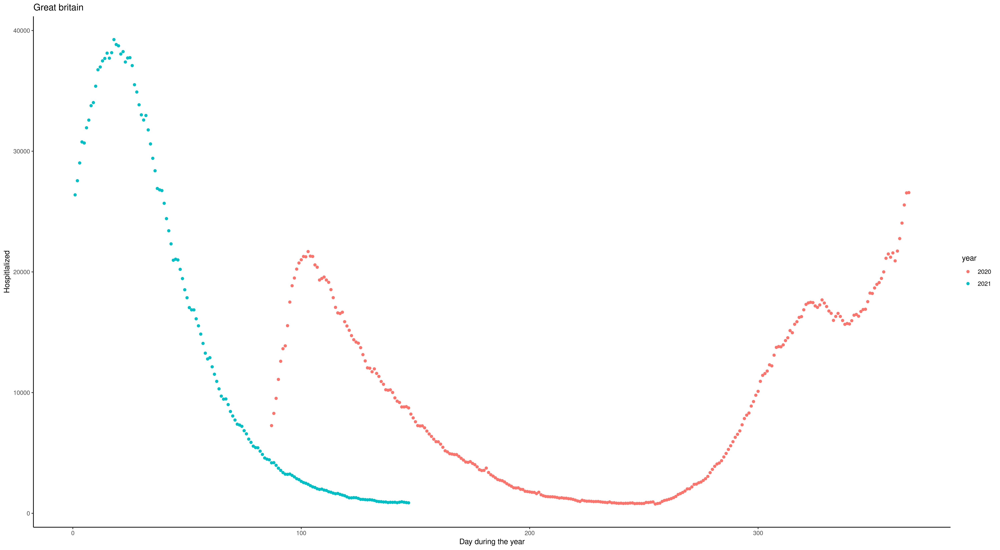
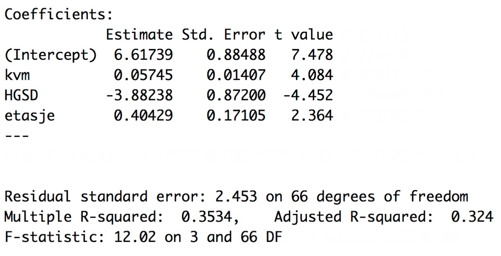
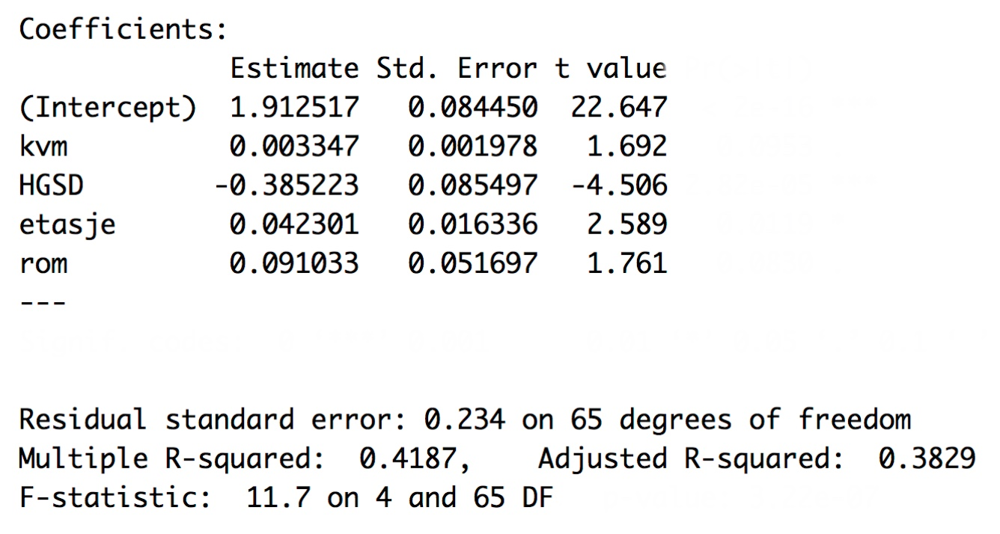

---
output:
  html_document:
    toc: no
    toc_depth: 3
---

<script type="text/x-mathjax-config">
  MathJax.Hub.Config({
    TeX: { equationNumbers: { autoNumber: "AMS" } },
  });
</script>
<style>
.mjx-mrow a {
  color: black;
  pointer-events: none;
  cursor: default;
}
</style>


<h1><center>**Exam Econometrics (MSB104)**</center></h1>

<div class="solution">
<center>**SOLUTION PROPOSAL**</center>
</div>

<h2>**Subject code**: MSB104</h2> 

<h2>**Date of exam**: 4.06.2021</h2> 

<h2>**Language**: English (you may submit your answer in English or any scandinavian tongue)</h2> 

<h2>**Course coordinator**: Henrik Lindegaard Andersen (hlan@hvl.no)</h2> 

## General information ##
- State any references clearly (as your assignment will be cross-checked in text analysis software). 
- Remember that the exam is *INDIVIDUAL*. It is NOT allowed to collaborate with others during the exam. Otherwise, all aids are allowed.
- You may write by hand and/or use any text editor; your answer must be uploaded to WISEflow as ONE final PDF-document.
- Do NOT write any personal identifiers on your hand-in (e.g. name or student id).
- You are NOT supposed to gather data OR to run any regression in this assignment.
- Your answer to each sub-question within Part I (210 minutes) will be given an equal weight in the evaluation, and equally for Part II (90 minutes).
- Do you have questions to the exam text? Part I/II: 92345700/41611857 (Henrik/Jørn). 
</h2>

\newpage


# Part II: Regression analysis with time series data and simultanous equations models (90 minutes)

Part II consists of three subsections. Each subsection is given equal weight. It is sufficient to provide short and punctuated answers to all of the questions.

## Short questions 

1. In time series econometrics, explain the conceptual differences for the data generating process (DGP) before and after its realization.   

2. Explain why a contemporanous exogenous process differs from a strictly exogenous process.

3. Assume that you detect that TS.3 is violaed but not TS.3'. Given that the other time series assumptions are satisfied, how would this impact your results?

4. Assume that you want to estimate in a time series model the impact of a lockdown on the number of hospitalized Covid patient in Italy. Given the plot below, which variable do you think should be included in such a model in order to eliminate the problem of spurious regression? 

{width=50%}

5. Why do you think the year-to-year pattern of the plot from Great Britain differ such from  Italy, and how would you account for this in a time series regression model?

{width=50%}

6. Why are demand and supply curves (with structural interpretation) difficult to estimate when using real life data?

7. Is there a approach to solve this problem?

## Stochastical regression models 

We have the following AR(1) process.

\begin{equation}
y_{t}=\mu+\rho y_{t-1}+u_{t} \text{ where } u_{t}\sim N(0,\sigma^2_{u})
\end{equation}
and moving average MA(1) process:
\begin{equation}
y_{t}=\gamma+e_{t}+\theta e_{t-1} \text{ where } e_{t} \sim N(0,\sigma^2_{e})
\end{equation}


1. Find for the two model specifications above its mean and and one-period ahead forecast value

<div class="solution">
AR(1)
\begin{equation}
E(y_{t})=E(\mu + \rho (\rho y_{t-2}+ e_{t-1}) +e_{t}) = \mu + E(\sum_{j=0}^{\infty} \alpha^{j}(\mu+ e_{t-j}) ) = \sum_{j=0}^{\infty}\alpha^{j} \mu \\
\end{equation}
\begin{equation}
y_{t+1}=\mu + \rho y_{t}+u_{t+1} \Rightarrow E(y_{t+1}|y_{t}) = E(\mu + \rho y_{t}+e_{t+1}|y_{t})=\mu+\rho y_{t}
\end{equation}

MA(1)
\begin{equation}
E(y_{t})=E(\gamma + e_{t} + \theta e_{t-1})= \gamma    \\
\end{equation}
\begin{equation}
y_{t+1}=\gamma + e_{t+1}+\theta e_{t} \Rightarrow E(y_{t+1}|y_{t})=E(\gamma + e_{t+1}+\theta e_{t}) = \gamma + \theta e_{t}
\end{equation}
</div>

2. Why can't OLS be applied to the estimation to both of the model specifications?

3. Do you think its advisable to use the model specification of the MA(1) process to model the stock market?

## Application: The Phillips-Curve
Cf. appendix part II for output information.

(a) Explain the main difference between the two model specifications\

(b) In the diagnostic part of a time series regression model, does the output provide any clues of which specification that should be used?


(c) Interpret the results from the estimation of the coefficients and explain why the standard deviations differ in the two cases?

\newpage

# Appendix 

## Part I

### Table 1


### Table 2


\newpage

## Part II

```{r, child=c('application/Application_Phillips_static.Rmd')}
```


