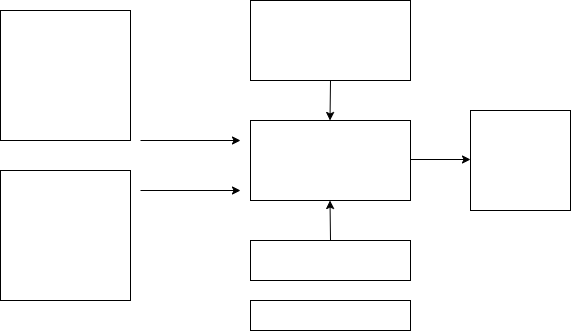

---
output:
  html_notebook:
    toc: true
    toc_depth: 2
---



```{r, include=F, eval=T}
library(knitr)
#system2('rnotb2 8901 $PWD losningsforslag.Rmd')
```

# Data sample (realized $\tilde{}$ DGP)
\begin{equation}
\tilde{\textbf{X}}=

\begin{bmatrix}
\tilde{x}_{L1} & ...  &  &   \tilde{x}_{Lk} \\ 
...    &  &  &   ...    \\
\tilde{x}_{11} & ...  &  &   \tilde{x}_{1k} \\ 
\tilde{x}_{21} &  &  &   \tilde{x}_{2k} \\ 
...    &  &  &   ...    \\
\tilde{x}_{nt} & ...  &  &   \tilde{x}_{nk} \\ 
\end{bmatrix}
\end{equation}

\begin{equation}
\tilde{\textbf{x}}_{t}=(\tilde{x}_{1t}, \tilde{x}_{2t},...,\tilde{x}_{kt})
\end{equation}

# Data generating process (DGP) and its regression model
- $\{(x_{1t},x_{2t},...,x_{kt},y_{t});t=1,2,..,,n\}$
- Model specifications (examples):
  - Static (contemporanous model)
  - Finite distributed lagged model
    - AR(1)
    - MA(1)
- Model suggestions 1:
  - Functional form
  - Dummy
  - Index number
- Model suggestions 2:
  - Time trend
  - Seasonality

# Diagnostics
```{r echo=F, message=FALSE, warning=FALSE}
colnames <- c("", "Omitted variables (e.g, (1) trend (2) lagging)", "Highly persistent time series (I(1))", "Serial correlation", "Heteroskedasticity", "Simultaneity")
c1 <- c("Violation", "Detecting", "Correcting")
c2 <- c("TS.3/TS'.3", "Graphical", "(1) Inclulde time trend, (2) more lags")
c3 <- c("TS'.1", "Graphical/(formal)", "First differentiating (I(0) $\\sim \\Delta$ I(1))")
c4 <- c("TS.5/TS'.5", "Testing with or without strictly exogenous regressors", "Transformation/Robust standard errors (HAC)")
c5 <- c("TS.4/TS'.4", "Testing", "Transformation/Robust standard errors")
c6 <- c("TS.3/TS'.3", "Economic theory", "IV-approach")
df <- data.frame(c1,c2,c3,c4,c5,c6)
knitr::kable(df, col.names=colnames)
```

# Model estimation
## Method
\begin{equation}
\underset{\hat{\beta}_{j} \text{for} j=0,1,...,k}{\text{OLS: Min RSS}}
\end{equation}

# Properties
## Properties finite sample (TS.1-TS.6)
```{r, echo=F}
colnames <- c("","$\\Delta$")
c1 <- c("TS.1:", "TS.2:", "TS.3:", "TS.4:", "TS.5:","TS.6:")
c2 <- c("Linear in its parameters","No perfect collinarity", 
	"E($u_{t}$|$\\textbf{X}$)=0","Var($u_{t}$|$\\textbf{X})=0$",
	"Corr($u_{t}$,$u_{s}$|$\\textbf{X})=0$","$u_{t} i.i.d. \\sim N(0,\\sigma^2_{u})$")
c3 <- c("v","v","v","","","")
c4 <- c("v","v","v","v","v","")
c5 <- c("v","v","v","v","v","v")
df <- data.frame(c1,c2,c3,c4,c5)
colnames <- c("Assumption","Property","OLS is unbiased", "OLS is BLUE", "$\\hat{\\beta}_{j} \\sim ~ N(,)$")
knitr::kable(df, col.names=colnames)
```

## Properties large sample (TS'.1-TS'.5)

```{r, echo=F}
c1 <- c("TS'.1:", "TS'.2:", "TS'.3:", "TS'.4:", "TS'.5:")
c2 <- c("TS'1=TS1+Stationarity+Weakly dependency","No perfect collinarity", 
	"E($u_{t}$|$\\textbf{X}_{t})=0$)","Var($u_{t}$|$\\textbf{X}_{t})=\\sigma^{2}$",
	"Corr($u_{t}$,$u_{s}$|$\\textbf{X}_{t})=0$")
c3 <- c("v","v","v","","")
c4 <- c("v","v","v","v","v")
df <- data.frame(c1,c2,c3,c4)
colnames <- c("Assumption","Property","OLS is consistent", "$\\hat{\\beta}_{j} \\sim a.s. ~ N(,)$")
knitr::kable(df, col.names=colnames)
```

# Estimation results
## Non-robust
```{r, echo=F}
colnames <- c("", "$\\Delta$")
c1 <- c("Predictions","$R^{2}$ and its adjusted","Std","t-tests","F-test")
c2 <- c("v", "v", "", "", "")
c3 <- c("", "", "x", "x", "x")
df <- data.frame(c1,c2,c3)
colnames <- c("","Point estimates","Statistical Inference")
knitr::kable(df, col.names=colnames)
```

## Robust
```{r, echo=F}
colnames <- c("", "$\\Delta$")
c1 <- c("Predictions","$R^{2}$ and its adjusted","Std","t-tests","F-testing")
c2 <- c("v", "v", "", "", "")
c3 <- c("", "", "v", "v", "v")
df <- data.frame(c1,c2,c3)
colnames <- c("","Point estimates","Statistical Inference")
knitr::kable(df, col.names=colnames)
```


